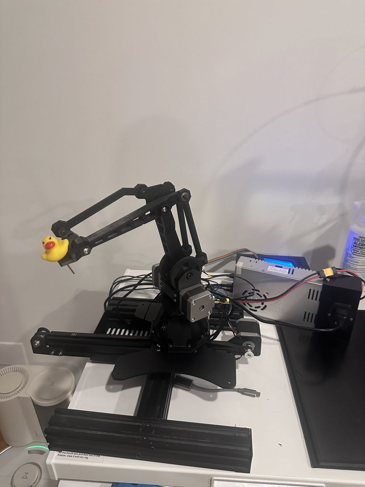
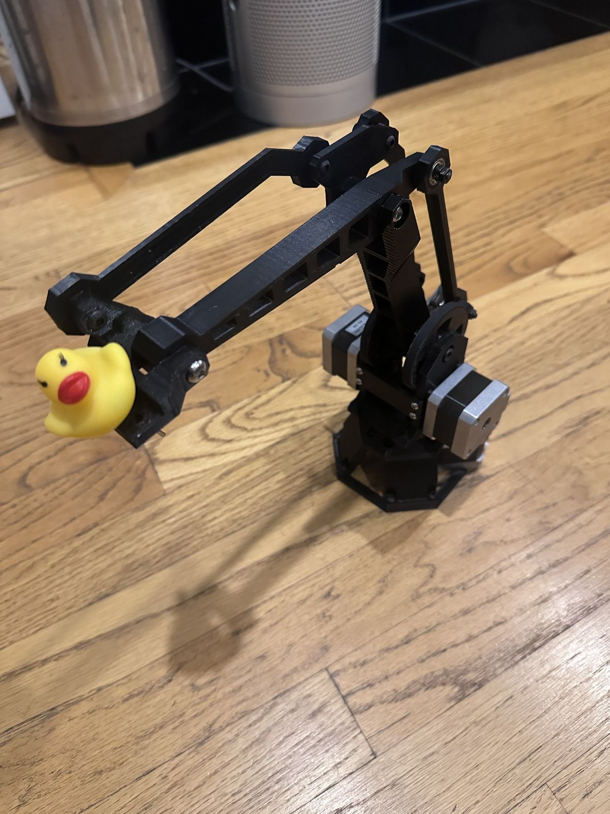
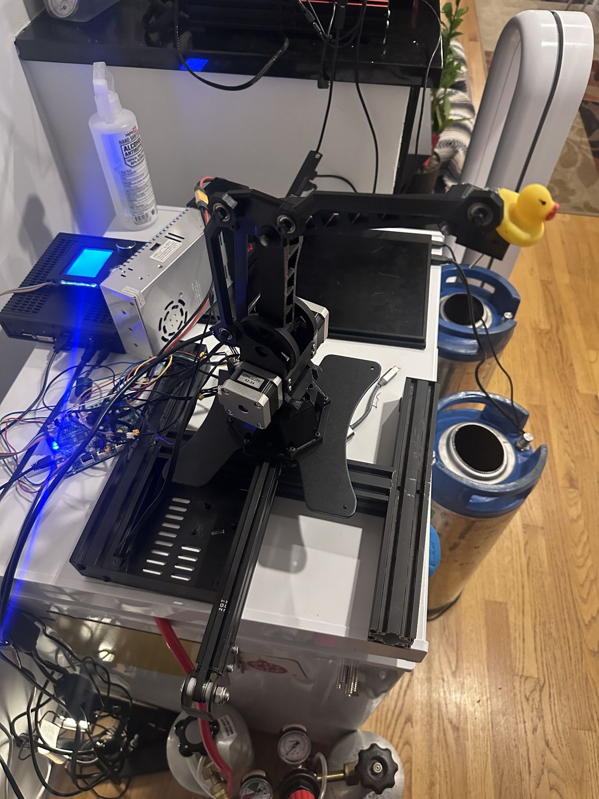
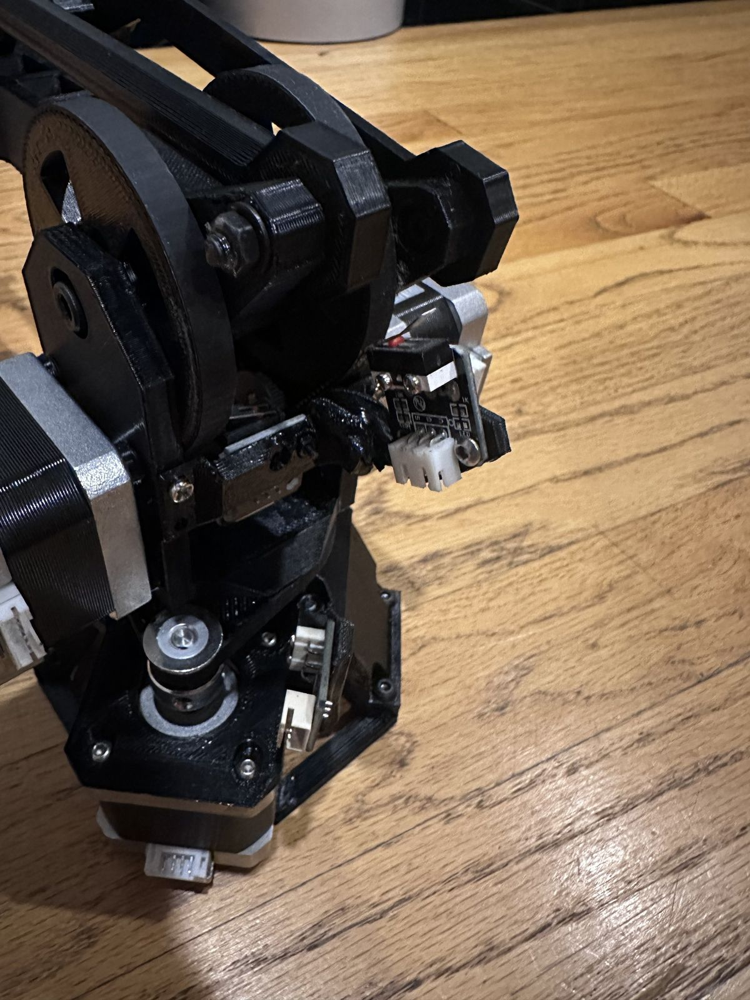
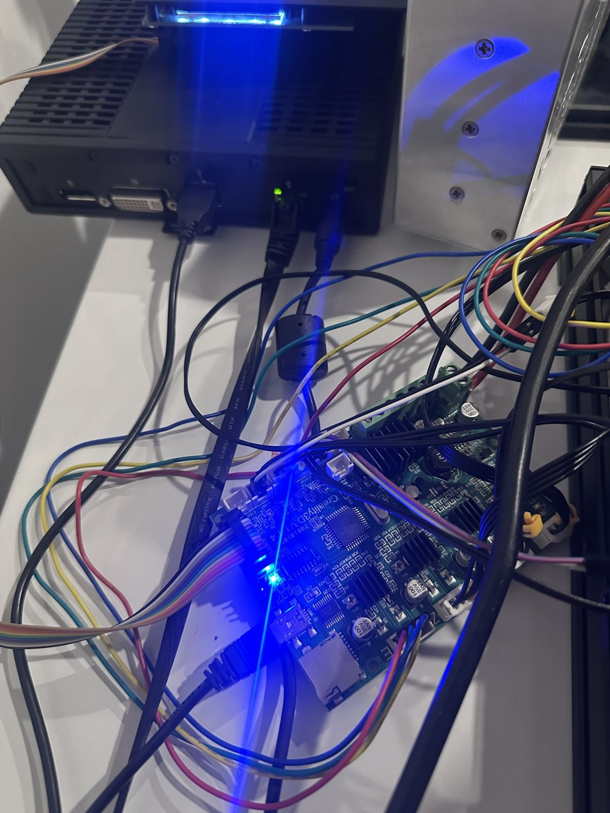

# Ender 3 → 4-DOF Robot Arm

Convert a low-cost used Creality Ender 3 or Ender 3 Pro into a programmable 4-DOF robotic arm for learning robotics, kinematics, motion control, and non-Cartesian mechanisms.


<p align="center">
  
</p>

The project reuses the donor printer's frame components, stepper motors, power supply, wiring, endstops, controller board, and original linear Y-axis. The reference build was developed and tested from an Ender 3. An Ender 3 Pro can be used as well; board revisions and mounting details should always be verified before flashing firmware or assembling printed parts.

## Reference build

The photos below show the current working reference assembly and the major subsystems reused from the donor printer.

| Arm and linkage | Complete reference system |
| --- | --- |
|  |  |
| **Base rotation and endstops** | **Controller and host wiring** |
|  |  |

A detailed bearing and linkage close-up is available in [the mechanical assembly photos](docs/images/mechanical-assembly/linkage-bearing-detail.jpg).

## Why this project exists

A 3D printer is already a complete motion-control platform: stepper motors, drivers, power electronics, limit switches, belts, pulleys, a rigid frame, and a host-to-controller communication path. This project repurposes those parts into an articulated mechanism so the same hardware can be used to study:

- forward and inverse kinematics
- closed-linkage motion
- joint-space and Cartesian control
- homing and calibration
- motion planning
- workspace limits
- motor dynamics
- belt reduction
- coordinated multi-axis motion
- embedded motion control with Klipper

A used Ender 3 can often be found for roughly $30. The conversion is designed to reuse as much original hardware as possible.

## Four degrees of freedom

The arm uses four powered motions:

| DOF | Function | Donor hardware |
| --- | --- | --- |
| 1 | Linear base travel | Original Ender Y-axis carriage |
| 2 | Base rotation | Reused Ender stepper |
| 3 | Main arm joint | Reused Ender stepper, 20T-to-90T belt reduction |
| 4 | Crank/linkage joint | Reused Ender stepper, 20T-to-90T belt reduction |

The two arm-side motors drive a closed linkage rather than a conventional serial shoulder/elbow pair. The main arm is driven through the 120 mm A-C link and the second motor drives the 40 mm A-B crank. The linkage constrains the remaining arm geometry and keeps the tool structure oriented through the workspace.

## Control architecture

The reference control stack uses the original Ender controller board as the real-time motion controller running Klipper.

```text
Browser / control UI
        |
        v
Python arm controller + kinematics
        |
        v
Moonraker / Klipper host
        |
       USB
        |
        v
Original Ender controller board
        |
        v
4 stepper motors + endstops
```

The host can be:

- Dell Wyse thin client running Debian or another Linux distribution
- Raspberry Pi
- Linux desktop or laptop
- another computer capable of running Klipper, Moonraker, and the control application

The Dell Wyse is the reference external-host build, but it is not required.

## Additional hardware

The conversion is intended to keep the purchased hardware minimal. The reference build uses:

- GT2 timing belt, 6 mm wide
- GT2 20-tooth motor pulleys
- 608ZZ deep-groove ball bearings where specified by the printed arm
- 6 mm precision steel balls where specified by the mechanism
- printed adapters/spacers that allow the bearing interfaces to use the donor printer's original M5 hardware instead of requiring M6 fasteners

The exact quantities and part-by-part locations are maintained in the hardware documentation.

## Repository layout

```text
EnderArm-4DOF/
├── README.md
├── CONTRIBUTING.md
├── THIRD_PARTY.md
├── docs/
│   ├── README.md
│   ├── build/
│   ├── electronics/
│   ├── host/
│   ├── kinematics/
│   ├── calibration/
│   ├── troubleshooting/
│   └── images/
├── hardware/
│   ├── README.md
│   ├── bom/
│   ├── stl/
│   ├── step/
│   └── adapters/
├── software/
│   ├── README.md
│   ├── host/
│   ├── klipper/
│   └── tests/
└── config/
    ├── ender3/
    └── ender3-pro/
```

## Build path

1. Verify the donor printer and controller board.
2. Disassemble the X/Z gantry while retaining the Y-axis base.
3. Print the arm components and Ender-specific adapters.
4. Assemble the base rotation and closed-linkage arm.
5. Install belts, pulleys, bearings, and endstops.
6. Wire the four reused Ender steppers to the original controller.
7. Install Klipper and Moonraker on the host.
8. Install the EnderArm control software.
9. Home and calibrate each powered axis.
10. Measure the physical joint-zero offsets.
11. Validate the workspace boundary.
12. Test joint-space motion, Cartesian targets, and coordinated trajectories.

## Kinematics

The side-plane arm uses the following coordinate convention:

- origin A: the concentric side-drive pivot
- +Y: outward toward the tool
- +Z: upward
- +X: normal to the side plane
- qX: angle of the 120 mm A-C main arm
- qY: angle of the 40 mm A-B crank
- 0°: link points along +Z
- positive angle: rotation from +Z toward +Y

The main driven points are:

```text
B = (40 sin(qY), 40 cos(qY))
C = (120 sin(qX), 120 cos(qX))
```

Both side drives use a 20T motor pulley and 90T output pulley, giving a 4.5:1 reduction.

Detailed linkage geometry, forward kinematics, inverse kinematics, calibration, and workspace limiting are documented under `docs/kinematics/`.

## Photos and build documentation

All build photography follows the capture plan in `docs/images/README.md`. Photos are organized by build stage so each image can be referenced directly from the corresponding assembly document.

## Third-party mechanical design

This conversion builds on an existing printable parallel-link robot-arm design. Upstream attribution and redistribution terms are documented in `THIRD_PARTY.md`.

Third-party files should only be committed to this repository when their license explicitly permits redistribution. Ender-specific adapters and modifications are maintained separately so the origin of each file remains clear.

## Project status

The mechanical conversion and arm-control workflow have been validated on the working Ender 3 reference build. Documentation, source CAD, printable files, host setup, Klipper configuration, and calibration procedures are being organized here as a reproducible build.
